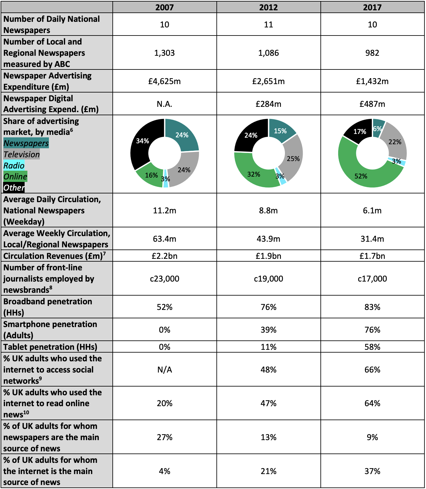

Recently, I was drawn back into the world of AMP when [I was credited with the suggestion](https://twitter.com/tobie/status/1126141099725271040) for [promotable IFRAMEs](https://discourse.wicg.io/t/proposal-for-promotable-iframe/2375), and therefore the genesis of the [Portals spec](https://wicg.github.io/portals) that it evolved into. I wanted to firmly distance myself from portals, because I see them as part of the effort to normalise the use of the **AMP Carousel**, which is an anti-competitive land-grab for the web by an organisation that seems to have an insatiable appetite for consuming the web, probably ultimately to it’s own detriment.

> To be honest, last time I looked, it seemed like it had been designed to enable the AMP carousel. The carousel is a monopolistic land grab for the web and I want no part of it.
> 
> — Andrew Betts (@triblondon) [May 8, 2019](https://twitter.com/triblondon/status/1126197778835804165?ref_src=twsrc%5Etfw)

I subsequently sat down with [Kenji Baheux](https://twitter.com/KenjiBaheux), because Twitter is not a great forum for debate, and this blog post will try and make the problems clearer. Let’s divide AMP and its related standards into three areas: Technical, User experience and Commercial. These are indivisible – so we can’t have a discussion about the standards without also understanding what they enable and the commercial incentives they create.

### Technical

Technology standardisation is about long term vision, respecting the architectural foundations of the existing platform, and solving the ‘right problem’. In the past, AMP has been responsible for some mind-blowingly terrible suggestions in this regard, such as:

*   Adapt the [`requestFullscreen`](https://developer.mozilla.org/en-US/docs/Web/API/Element/requestFullScreen) API such that a browser chrome can appear within the full screen view. So that it is… not full screen?
*   Where a URL starts with `https://www.google.com/amp/s`, just don’t display that part. The Google Search app actually does this already today. Terrifying.

Right now though, we have some more well-rounded ideas on the table, and it’s harder to object to them on purely technical grounds. In the case of Portals, the idea is to create a kind of IFRAME that doesn’t inherit any style or environmental data from the parent page, and therefore can be ‘activated’ to become the new top-level browsing context without having to be re-rendered (ie. instantly). The basic premise is fine, but let’s dig into the detail of [“portal state”](https://wicg.github.io/portals/#portal-state):

> A top-level “none” context can become “orphaned” by activating another context. An “orphaned” context can be adopted to become a “portal” context. A “portal” context can become a “none” context by being activated by its host browsing context.

This enables Google to continue to exist after the destination site (eg the New York Times) has been navigated to. Essentially it flips the parent-child relationship to be the other way around. The destination site has to opt into this (but see [coercion](#coercion) below). This thinking is not how the web is designed to work and is acting against the ethos that made the web successful. When [I proposed promotable IFRAMEs](https://discourse.wicg.io/t/proposal-for-promotable-iframe/2375), I specifically saw the end of this kind of behaviour as one of the key advantages. Remove the idea of `orphaned` state, and the concept of ‘adoption’, and then portals are fine and have my full support.

In relation to [Web packaging](https://github.com/WICG/webpackage) and [signed exchanges](https://wicg.github.io/webpackage/draft-yasskin-http-origin-signed-responses.html), the idea here is to allow a page and all its sub-resources to be preloaded in a privacy-preserving way, before a user declares an intention to navigate there. Right now, that can only be done by Google proxying the requests, causing the `www.google.com/amp/s` prefix problem. With web packaging, a publisher can digitally embed their domain into a piece of content, making it possible to download that content from any URL and the browser would still show `nytimes.com` or whatever. This is also a great solution for saving webpages to disk, and some say for exchanging web content offline, eg via USB sticks (yawn).

I’ve described this to colleagues as a _‘skynet moment’_ for the web. In Terminator, a sentient AI is released to try and stop a virus. It does so. And then [decides to take over the world](https://en.wikipedia.org/wiki/Terminator_3:_Rise_of_the_Machines).

As soon as a publisher blesses a piece of content by packaging it (they have to opt in to this, but see [coercion](#coercion) below), they totally lose control of its distribution. It would be possible to make a whitelist of domains that are allowed to distribute the content but that implies that the whitelist will just be Google and that looks like coercion (because it is). Instead, the main ‘safety catch’ that has been built into web packaging is that packages expire after 24 hours.

Now, I say that if content is sufficiently fast, it shouldn’t need preloading. We can get to fast with standards like [Feature Policy](https://developer.mozilla.org/en-US/docs/Web/HTTP/Feature_Policy) (which I [really like](https://featurepolicy.info)) and metrics like [Speedindex](https://sites.google.com/a/webpagetest.org/docs/using-webpagetest/metrics/speed-index). We don’t need to get to instant. [Navigation transitions](https://github.com/jakearchibald/navigation-transitions) help here too, but seem to have stalled again. However, if you MUST have preloading, then you need packaging, so lets see how this could be improved:

*   Require distributors to request packages signed for their distribution origin as well as the content origin. I want to know that Google is using my package.
*   Allow the publisher to set the expiry time of the package. For the offline distribution use case, maybe I want months. For the AMP use case, 10 minutes should be fine
*   Allow requests to go outside the package when it becomes the top level browsing context. This would allow me to ship a package that contains the shell of the page but no text, so I can understand who the user is before serving the text.

I’m not that smart, so it’s surely possible to figure out other ways of making a preload possible without cutting off the content creator from the people consuming their content.

### User experience

Most of the arguments I hear from Googlers about AMP are about user experience, and sometimes it feels like they’re suggesting it’s the only factor worth considering. Let’s break down a few points here:

*   **The web is under threat from native apps:** True. But is that a problem? I mean, when I started using the web, I was using a native app with IMAP for email, and a [Usenet](https://en.wikipedia.org/wiki/Usenet) client with NNTP for news groups. Those apps ended up effectively dying off and getting replaced by the web. And now bits of the web (notably chat and social networking) are dying off and getting replaced by apps. It’s a cycle. The web is still there, and as long as you don’t break it, will find new use cases. Sometimes the web is better, sometimes native is better. Why try and turn one into the other?
*   **Publishers have terrible websites:** True. And this has definitely required an intervention. But casting the web aside and pushing a new proprietary content format (which is optional, but see [coercion](#coercion)) seems like an extraordinarily heavy handed way to address it. It’s like saying I see you have a graze on your knee so let’s chop off and replace your whole leg. Instead, we could use the carrot of a premium search result position (as AMP has done) and make it only possible to be there if your site is fast.
*   **People like seeing different perspectives:** Manifestly false. People like seeing that their existing biases are confirmed by multiple sources, and don’t want to know that there are 10x as many (or sources 10x as reputable) that refute them. This is point of user experience where giving people exactly what they want leads to a decrease in intelligent thought and rational decision making. At the scale of billions of people this can be (and has been), catastrophic to democratic societies.

The front page of a newspaper is a carefully curated thing, and historically logistical limitations would constrain the impact of an errant editor who had ambitions of malicious disinformation. Today, commercial constraints and the overt nature of ownership still to some extent keep traditional media in check. No such checks exist for purely digital, new media publishers, whose origins can be obscured. So I am justifiably horrified when, in the wake of a terrorist attack, the [FT](https://www.ft.com) (for whom I used to work) will spend hours figuring out how to present fragmented information in the most appropriate way, while [Google blithely displays pages from _4chan_ in Top Stories](https://www.theverge.com/2017/10/3/16413082/google-4chan-las-vegas-shooting-top-stories-algorithm-mistake)

This equates a responsible, expensively produced, extensively researched, professional newsgatherer with some guy who thinks the earth is flat for no reason other than that it ‘kinda feels right’.

Recognising and respecting that one type of information is not the same as another, for some reason, seems hard to grasp. [The BBC has been censured by the regulator in the UK several times](https://blogs.lse.ac.uk/mediapolicyproject/2014/04/02/false-balance-in-climate-reporting-reveals-bbcs-sensitivity-to-political-pressure/) for so-called **false equivalence**, on topics ranging from climate change to homeopathy. **This isn’t just a bug you need to fix.** It’s an institutional, cultural problem within Google.

### Commercial

AMP is a form of syndication, where content produced and normally distributed by one party is instead distributed by another party as part of a larger product. For two centuries, newspapers have been doing this. Since the dawn of the digital age, the Financial Times has been available via Bloomberg terminals. In the 90s, we got [RSS](https://en.wikipedia.org/wiki/RSS), which kickstarted the idea that syndication might be free, but critically in this kind of relationship, the publisher gets to decide what they syndicate, in what form, and for how long. In the 2000s ‘richer’ syndication was still the preserve of commercial agreements (Bloomberg is paying FT a lot for all that content).

Enter AMP. By AMP’s way of thinking, it’s a better user experience for Google to syndicate your content, so they’ll just go ahead and do this without paying you for it (it’s opt in, but see [coercion](#coercion)). It’s also better if they decide what is and is not allowed to be in your content and keep control of the user experience to the extent that they even control _navigational gestures within **your** page_.

The web is open and decentralised. We spend a lot of time valuing the first of these concepts, but almost none trying to defend the second. Google knows, perhaps better than anyone, how being in control of the user is the most monetisable position, and having the deepest pockets and the most powerful platform to do so, they have very successfully inserted themselves into my relationship with millions of other websites.

How would a publisher build a sustainable business model on this basis? It’s like a matchmaker that arranges a dinner date for you but comes with you on it, and after each course, removes your date and replaces them with another one. Who wins? Short term, you and the matchmaker. Medium term, just the matchmaker. Long term, nobody.

Finally, consider the relative priorities placed on protecting Google’s business vs respecting the business of others’. Since the inception of [“first click free”](https://webmasters.googleblog.com/2008/10/first-click-free-for-web-search.html), it’s been possible to cheat and get free content simply by setting a known, predictable string (the `Referer` header) into the request. Imagine if doing that allowed me to get free content from the Play store. The bug fix for that would land pretty bloody fast.

In AMP, the support for paywalls is based on a recommendation that [the premium content be included in the source of the page](https://dangoldin.com/2017/04/16/amp-and-subscription-paywalls/) regardless of the user’s authorisation state. Then portions can be hidden or displayed as required. This is equivalent to say, having all the physical access barriers at Google offices plugged into a power outlet that is _outside_ the secured area, so I can walk into any Google office just by unplugging the security gate.

These policies demonstrate contempt for others’ right to freely operate their businesses.

### Coercion

AMP team members have been known to observe that they are ‘surprised and delighted’ by how popular AMP is. In the face of that I can’t improve on [the words of the great Eddie Izzard](https://youtu.be/PVH0gZO5lq0?t=293):

> – “Cake or death!?”  
> – “Eh, cake please!”  
> – “Very well! Give him cake!”  
> – “Oh, thanks very much. It’s very nice.”  
> – “You! Cake or death?”  
> – “Uh, cake for me, too, please.”  
> – “Very well! Give him cake, too. We’re gonna run out of cake at this rate. You! Cake or death?”  
> – “Uh, cake please.”  
> – “Well, we’re out of cake! We only had three bits and we didn’t expect such a _rush_.”

It is utterly bizarre to me, akin to a street robber that has convinced himself that people just randomly like giving him their money and has managed to forget the fact that he’s holding a gun to their head.

I’m told ‘we talk to publishers’. I’ve been to several of the events at which this kind of talking takes place, and though I’m sure private meetings might sometimes be more candid, the general feeling I get is that most publishers are simply in damage limitation mode, and will praise Google products in exchange for the powerful co-marketing opportunities that are available. I’ve sat in meetings where the entire goal was to get on the stage at Google I/O.

### Conclusion

The bottom line here is that the news industry is in the midst of a full blown disaster, society around the world is being starved of intelligent thought and the results are horrifying. AMP is partly responsible for this, and if there’s a bug to be fixed, it is the people who invented it and still think it’s a good idea. They are the bug. I’m sorry I can’t file a GitHub issue for that.

Take a look at this:

:::figure
    
    DCMS overview of the *press* market ([Mediatique, _2018_](https://assets.publishing.service.gov.uk/government/uploads/system/uploads/attachment_data/file/720400/180621_Mediatique_-_Overview_of_recent_dynamics_in_the_UK_press_market_-_Report_for_DCMS.pdf))
:::

That’s the UK. In the US, [BusinessInsider documents 2400 job losses in the US media industry](https://www.businessinsider.com/2019-media-layoffs-job-cuts-at-buzzfeed-huffpost-vice-details-2019-2?r=US&IR=T) in _just in Q1 of 2019_.

So what could Google do differently?

*   Drop the ‘orphaned’/’adoption’ concept from Portals
*   Make it possible to get into the carousel _without using AMP_ as the content format. Just do it based on a speed metric. Turn off AMP until you can ship this.
*   Only preload sites that opt into that behaviour by publishing a web package (and don’t discriminate against those that don’t)
*   Make the changes to web packaging outlined above
*   Build [newsguard](https://www.newsguardtech.com/) or other indications of reputability into result UI
*   Understand premium content better. [I made a previous proposal for ‘content passes’](https://trib.tv/2015/11/08/content-passes/). That might work.

And reflect on whether, when so many news operations are closing, content is increasingly polarised and hate is the new normal, what might be the cause of this?

**So this is why I am not happy about portals.** If we continue valuing content that is FAST over content that is RIGHT, and we continue expecting publishers to produce quality content almost for free, then the web will eventually just be cats and hate and we’ll be living in an Orwellian nightmare. Google needs to wake up to the fact that tinkering to improve engagement is doing serious damage _right now_.

If Google was my doctor, they’d be currently explaining to my family that although the experiment they tried did sadly kill me, they got a ton of useful data from it, and they think they can definitely work on fixing that bug in the next version of the experiment.

As long as enough publishers continue to desperately walk into the test chamber, the experimentation will continue. And when in ten years time those of us who can afford it are for the second or third time trying to work out how to move to somewhere that doesn’t resemble a Mad Max movie, maybe we’ll wonder whether we should have done something to improve the way that 5 billion people get informed.

Footnote: All of the above also applies to Facebook but I consider them a lost cause.